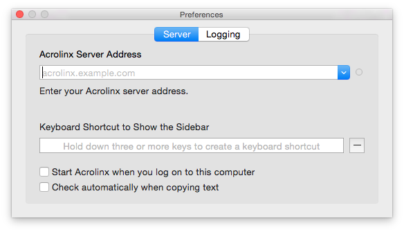
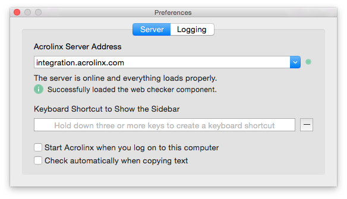
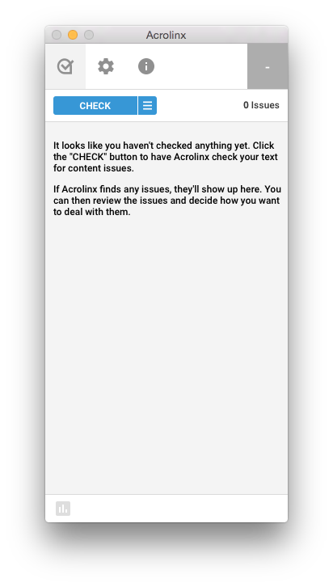
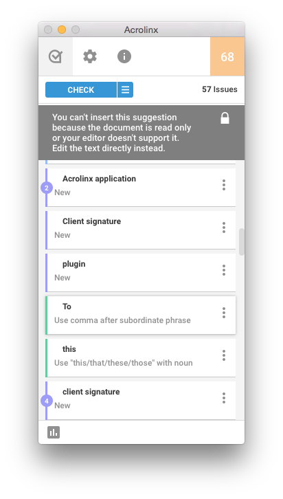

#Acrolinx OS X Sidebar Demo  

##Acrolinx Plugin Framework 


Acrolinx for Mac application can be used to check content of document open in an editor like Microsoft Word for Mac. For Acrolinx to be able to check it requires an Acrolinx Plugin written for particular target application. 

`AcrolinxPlugin.framework` helps develop Acrolinx plugin for different target applications. 

##Sample - Acrolinx Plugin for TextEdit


The sample shows how to use `AcrolinxPlugin.framework` for creating an acrolinx plugin for TextEdit application.

##Prerequisite


To build and run the sample you need the following:

* Acrolinx application (min version 1.4.0.613)
* Test server credentials
* Client signature(explained in “Configuration for Sample Plugin” section)

For writing new plugin you also need:

* AcrolinxPlugin.framework.


##Configuration for Sample Plugin

The Acrolinx Server checks if a connecting client is allowed to connect. To enable this you must provide a valid client signature. First obtain a client signature from Acrolinx. To enter new client signature in the code open `AcrolinxPluginTextEdit.xcodeproject`. Navigate to `AcrolinxPluginTextEdit.m`,  Find method `clientSignature` and edit the value to return the client signature you obtained from Acrolinx. 


##Build and Run Sample Plugin


Following are the steps to build and run the sample plugin. 

* Open AcrolinxPluginTextEdit.xcodeproject and build the project in Xcode.
* Put the output file AcrolinxPluginTextEdit.acpl to user’s PlugIns folder `(“~/Users/persistent/Library/Application Support/PluginIns”)`
* Run Acrolinx application. 
* In preferences give valid Acrolinx server URL.





* Open a TextEdit document, new documents must be saved once for the Acrolinx Plugin to identify it. 
* While TextEdit is the active application go to Acrolinx menu and select “Show Sidebar”. "Show Sidebar" menu is enabled only if the file extension is .txt or .rtf


* It would open a sidebar. Provide server credentials to login. 




* When sidebar is loaded run a check.



#Writing new Acrolinx Sidebar Plugin

##Prerequisite

For writing new Acrolinx plugin for a target application you need:

* Acrolinx application (min version 1.4.0.613)
* Test server credentials
* Client signature
* AcrolinxPlugin.framework.

You should also know:

* Target applications’s bundle identifier
* Way to find list of open documents and identifying active document. Acrolinx application creates sidebar for particular document. The plugin should keep track of the document it is associated with.
* Way to extract document content.
* Way to highlight and replace text in given range.

##Plugin Project Setup

* Create an Xcode project of type Bundle.
* Create new Cocoa class file. Set Principal Class in project info.plist to the given class name.
* In project build setting add `AcrolinxPlugin.framework` location in Frame Search Path.
* For Acrolinx application to identify and load the plugin the principal plugin class should be derived from the class `AcrolinxPlugin`. It should also implement protocols `AcrolinxPluginProtocol` and `AcrolinxSidebarDelegate`.

##Plugin Identification

* When Acrolinx application is launched it loads all supported plugins from location “~/Library/Application Support/PluginIns”. 
* Supported plugin would mean a plugin bundle whose principal
class `isSubclassOfClass` `AcrolinxPlugin` also it `conformsToProtocol` `AcrolinxPluginProtocol` and `AcrolinxSidebarDelegate`.

##Sidebar Loading

* Acrolix application continuously checks if it has a plugin for currently active application. 
* It queries the appropriate plugin for `frontmostFilePath` of the documents open in target application. 
* File extension of the frontmost file path also plays a role in enabling "Show Sidebar" menu. The extension should be part of `supportedExtensions` list of one of the loaded plugins. 
* When user selects "Show Sidebar" Acrollinx does performs few steps includeing: 
	* Creating appropriate plugin object
	* Instanciating the `AcrolinxSidebarController` and set the plugin object its delegate.
	* Calling `openFileAtPath` method, here plugin should save the file path for future reference to own file path.
	* Calling `loadSidebarURL`. The plugin should pass the sidebar URL to the `sidebarController` for loading.
*  For initialising sidebar the plugin should implement `AcrolinxSidebarDelegate` method `sidebarLoaded`.
*  Typical implementation of `sidebarLoaded` looks like this:
  

```
 #pragma mark - AcrolinxSidebarDelegate
 - (void)sidebarLoaded {
    
    NSMutableDictionary *sidebarOptions = [self createSidebarOptionsForPlugin];
    
    // parameter for readonly sidebar
    [sidebarOptions setValue:@"true" forKey:@"readOnlySuggestions"];
    
    [[[self sidebarController] JSInterface] initializeSidebarWithOptions:sidebarOptions];
}
```    

* The framework provides method to create the sidebar options needed for initialising the sidebar. The options include necessary version information and client signature etc. Plugin can add more options keys like "readOnlySuggestions" is needed.

## Extraction and Lookup

###Extraction 

* When user presses "Check" button in the sidebar the `AcrolinxSidebarInterface` gets a request to initiate check. 
* The plugin's principal class must implement `AcrolinxPluginProtocol` method `startGlobalCheck`. 
* Here plugin is expected to extract the content of associated file and handover the extaccted content to the  `AcrolinxSidebarInterface` instance. 
```
[[[self sidebarController] JSInterface] performGlobalCheck:stringExtractedFromEditor];
``` 
* Plugin may build a lookup data here. 

###Lookup

* Plugin's principal class should implement `AcrolinxSidebarDelegate` methods `sidebarDidSelectWithMatches` and `sidebarDidReplaceWithReplacements`.
* When user selects cards in sidebar for highlighting or replacement these methods are called accordingly. 
* Parameters holds array of dictionaries which hold content, range and replacements. 
* The offsets correspond to the cotent sent to the server. 
* The plugin should map these ranges to actual ranges in the document and interact with editor to perform highlight or replacement operation.

##Framework Reference
[Acrolinx Plugin Framework](./AcrolinxPluginSDKForMac/com.acrolinx.AcrolinxPlugin-Framework.docset/Contents/Resources/Documents/index.html)


## License

Copyright 2015-2016 Acrolinx GmbH

Licensed under the Apache License, Version 2.0 (the "License");
you may not use this file except in compliance with the License.
You may obtain a copy of the License at

http://www.apache.org/licenses/LICENSE-2.0

Unless required by applicable law or agreed to in writing, software
distributed under the License is distributed on an "AS IS" BASIS,
WITHOUT WARRANTIES OR CONDITIONS OF ANY KIND, either express or implied.
See the License for the specific language governing permissions and
limitations under the License.

For more information visit: http://www.acrolinx.com

