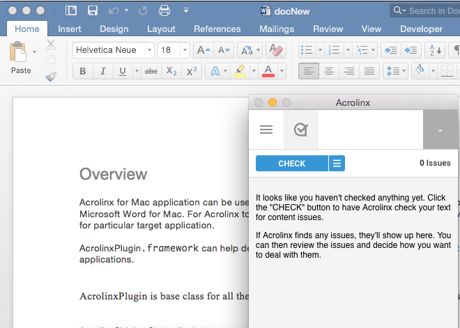
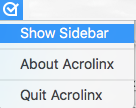
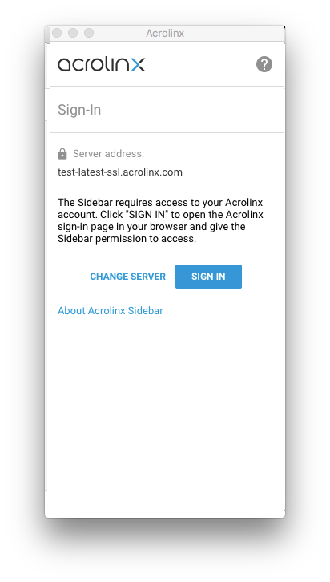
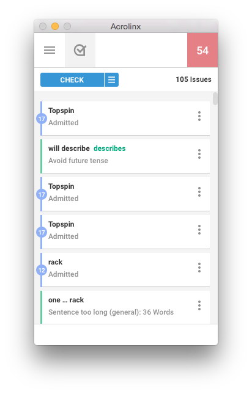

# Acrolinx OS X Sidebar Demo  

## Introduction

The following instructions and sample code will help you integrate [Acrolinx](http://www.acrolinx.com/) in a Mac OS X Application. 

### Acrolinx Sidebar
The Acrolinx sidebar helps writers to analyze, review, and correct their content. The sidebar is designed to appear in the editor or editing environment. 



### Acrolinx Application for Mac
The Acrolinx Application provides a way for developers to show the sidebar for an open document in any number of editors like Microsoft Word. You can show a sidebar only for those applications for which an Acrolinx plugin is installed. 


### Acrolinx Plugin Framework  
`AcrolinxPlugin.framework` helps you develop an Acrolinx plugin for different applications. The framework is available with this sample code in the `AcrolinxPluginSDKForMac` folder.

## Sample - Acrolinx Plugin for TextEdit


The sample shows how to use the `AcrolinxPlugin.framework` to develop an Acrolinx plugin for the TextEdit application.

## Prerequisites

Please contact Acrolinx SDK support (sdk-support@acrolinx.com) for consulting and getting your integration certified. This sample works with a test license on an internal Acrolinx server. This license is provided for demonstration and developing purposes only. Once you have finished your integration, you have to get a license for your integration from Acrolinx.

To build and run the sample, you need the following:

* Acrolinx application (min version 1.4.0.613)

* Test server credentials

For developing a new plugin, you also need:

* `AcrolinxPlugin.framework`. 


## Configuration for Sample Plugin

The Acrolinx Server checks if a connecting client is allowed to connect. The sample code includes a valid client signature so you can connect your client to a test server. To enter a new client signature in the code, follow these steps:

1. Open `AcrolinxPluginTextEdit.xcodeproject` 
2. Navigate to `AcrolinxPluginTextEdit.m` 
3. Find the method `clientSignature`
4. Edit the value to use the client signature that you received from Acrolinx. 


## Build and Run Sample Plugin


To build and run the sample plugin, follow these steps: 

1. Open `AcrolinxPluginTextEdit.xcodeproject` and build the project in Xcode.

2. Copy the output file `AcrolinxPluginTextEdit.acpl` to your PlugIns folder `~/Library/Application Support/PluginIns`

3. Run the Acrolinx application. 

4. Open a text file in TextEdit. If you create a document, you have to first save it for the Acrolinx Plugin to work. You can also use the test file `topspin.txt` in the `acrolinx-sidebar-demo-osx/doc` folder. 

5. Make sure TextEdit is the active application. Go to the Acrolinx menu, and select “Show Sidebar”. The "Show Sidebar" menu is enabled only if the file extension is ".txt" or ".rtf".

	

6. Click on “Show Sidebar” to open the Acrolinx Start Page. Enter the valid Acrolinx Server Address 

	
 
    If the server address is valid user is ready for Sign-In.
    
   	

	

7. When the sidebar is loaded, click Check.

	

8. After the check completes, cards should appear in the sidebar. Click a card to highlight the issue text in the document.

	

9. Clicking a suggestion replaces the text in the document. 

Note: If you edit the document manually, then you have to run another check to update the cards in the sidebar for  highlighting and replacements to work properly. 

# Writing new Acrolinx Sidebar Plugin

## Prerequisites

To develop an Acrolinx plugin for an application, you need the following:

* Acrolinx application (min version 1.4.0.613)
* Test server credentials
* Client signature
* `AcrolinxPlugin.framework`. The framework is available with this sample code in the `AcrolinxPluginSDKForMac` folder.

You should also know:

* The bundle identifier of the application for which you are developing an Acrolinx Plugin. You can find the bundle identifier in the `info.plist` file inside the application's bundle.
* How to find a list of open documents and identify the active document. The Acrolinx application creates a sidebar for each document. The plugin should keep track of the document and its sidebar.
* How to extract content from a document.
* How to highlight and replace text for a given range.

## Plugin Project Setup

1. Create an Xcode project of type Bundle.
2. Create Cocoa class file. Set Principal Class in project `info.plist` to the given class name.
3. In project build setting, add `AcrolinxPlugin.framework` location in Frame Search Path.
4. For Acrolinx application to identify and load the plugin, the principal plugin class should be derived from the class `AcrolinxPlugin`. It should also implement protocols `AcrolinxPluginProtocol` and `AcrolinxSidebarDelegate`.


## Plugin Identification

* When Acrolinx application is launched, it loads all supported plugins from the `~/Library/Application Support/PluginIns` folder.
* Supported plugin is a plugin bundle whose principal
class `isSubclassOfClass` `AcrolinxPlugin` also it `conformsToProtocol` `AcrolinxPluginProtocol` and `AcrolinxSidebarDelegate`.

## Loading Sidebar

* Acrolinx application continuously checks if it has a plugin for a currently active application. 
* It queries the appropriate plugin for `frontmostFilePath` of the documents open in target application. 
* The file extension of the front-most file is also important for enabling "Show Sidebar" menu. The extension should be part of the `supportedExtensions` list of one of the loaded plugins. 
* When a user selects "Show Sidebar", Acrolinx does the following: 
	* Creates appropriate plugin object
	* Instantiates the `AcrolinxSidebarController` and sets the plugin object its delegate.
	* Calls `openFileAtPath` method. The plugin should save the file path for future reference to own file path.
	* Calls `loadSidebarURL`. The plugin should pass the sidebar URL to the `sidebarController` for loading.
*  To initialize the sidebar, the plugin should implement `AcrolinxSidebarDelegate` method `sidebarLoaded`.
*  Typical implementation of `sidebarLoaded` looks like this:
  

```
 #pragma mark - AcrolinxSidebarDelegate
 - (void)sidebarLoaded {
    
    NSMutableDictionary *sidebarOptions = [self createSidebarOptionsForPlugin];
    
    // Parameter to make the sidebar read only.
    //[sidebarOptions setValue:@"true" forKey:@"readOnlySuggestions"];
    
    [[[self sidebarController] JSInterface] initializeSidebarWithOptions:sidebarOptions];
}
```    

* The framework provides a method to create the sidebar options needed for initializing the sidebar. The options include required version information,  client signature and so on. If needed, the plugin can add more option keys like "readOnlySuggestions".

## Extraction and Lookup

### Extraction 

* When user clicks "Check" in the sidebar, the `AcrolinxSidebarInterface` gets a request to initiate check. 
* The plugin's principal class must implement `AcrolinxPluginProtocol` method `startGlobalCheck`. 
* The plugin is expected to extract the content of associated file and hand over the extracted content to the  `AcrolinxSidebarInterface` instance. 
```
[[[self sidebarController] JSInterface] performGlobalCheck:stringExtractedFromEditor];
``` 

### Lookup

* Plugin's principal class should implement `AcrolinxSidebarDelegate` methods `sidebarDidSelectWithMatches` and `sidebarDidReplaceWithReplacements`.
* When user selects a card in sidebar, these methods are called accordingly for highlighting or replacement. 
* Parameter is an array of dictionaries which hold content, range, and replacements. 
* The offsets correspond to the content sent to the server. 
* The plugin should map these ranges to the actual ranges in the document and interact with the editor to highlight or replace text.
* You can refer to the link [here](https://cdn.rawgit.com/acrolinx/acrolinx-sidebar-demo/v0.3.37/doc/pluginDoc/interfaces/_plugin_interfaces_.acrolinxplugin.html#selectranges) for possible lookup strategies.

## Framework Reference
Refer to `doc/com.acrolinx.AcrolinxPlugin-Framework.docset` for the class reference.


## License

Copyright 2015-2016 Acrolinx GmbH

Licensed under the Apache License, Version 2.0 (the "License");
you may not use this file except in compliance with the License.
You may obtain a copy of the License at

http://www.apache.org/licenses/LICENSE-2.0

Unless required by applicable law or agreed to in writing, software
distributed under the License is distributed on an "AS IS" BASIS,
WITHOUT WARRANTIES OR CONDITIONS OF ANY KIND, either express or implied.
See the License for the specific language governing permissions and
limitations under the License.

For more information visit: http://www.acrolinx.com

